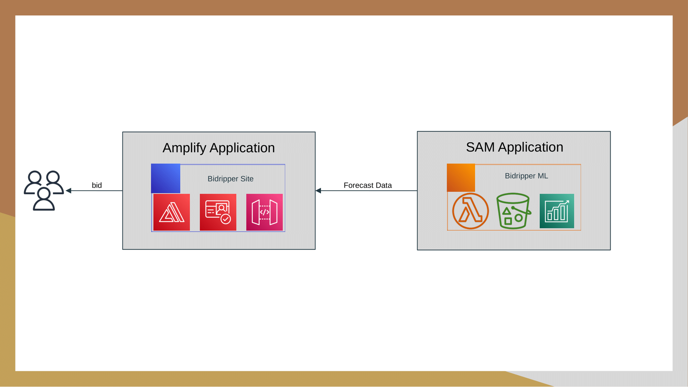
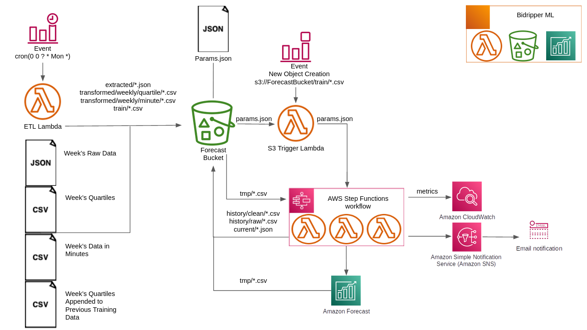
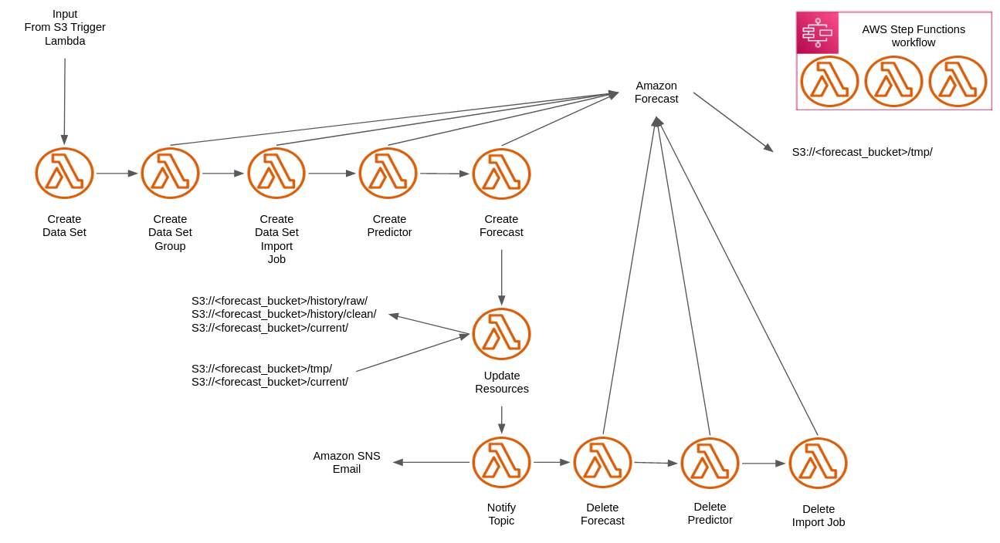

# Bidripper Project : Bidripper-ml

Get your weekly spot bid suggestion  [here](http://bid.hashripper.net)

## Build and Deploy 

These instructions are for a Linux environment, tested on an Ubuntu 20.04 fresh install.  

## Required packages

`sudo apt install wget`

## Make sure AWS CLI v2 is installed

Navigate to your home directory and install the AWS CLI
```bash
curl "https://awscli.amazonaws.com/awscli-exe-linux-x86_64.zip" -o "awscliv2.zip"
unzip awscliv2.zip
sudo ./aws/install
source ~/.bashrc
```

## Configure AWS profile

To deploy Bidripper you must have an AWS account, and it is highly recommended that you create a user that is **not** the root user. Once your account is created, create an admin user and save the account keys provided to you in a safe place because you will need them!

[Create a free AWS account and Admin User](https://docs.aws.amazon.com/translate/latest/dg/setting-up.html)


Once your AWS account is set up, get your (secret) access keys ready and then run in terminal

`aws configure`

When prompted, enter `us-west-2` for region, and `json` for default data type. This will configure a *_default_* profile that will be used later when building and deploying this SAM application.  

## Installing AWS SAM CLI

Navigate to your home directory and download the AWS SAM CLI  

```bash
wget https://github.com/aws/aws-sam-cli/releases/latest/download/aws-sam-cli-linux-x86_64.zip
unzip aws-sam-cli-linux-x86_64.zip -d sam-installation
sudo ./sam-installation/install
```

Follow this with a sanity check 
`sam --version` should provide an appropriate version number.

## Initializing Bidripper-ml From Git Repository

With the SAM CLI installed, navigate to the location you want the bidripper project and run  
`mkdir -p bidripper/bidripper-ml && cd bidripper/bidripper-ml && sam init --location https://github.com/Sinux1/bidripper-ml.git`

This will download and initialize the SAM application from the project's repository.  
Next, build and deploy:
`sam build && sam deploy --guided`  

Next you will be prompted to define several parameters, each having a default value from within the template.yaml file. These are:  
 - Stack name: Choose a stack name of your choice.
 - AWS Region: Choose a region of your choice but be aware the default region is the default region you selected when setting up your default profile using `aws configure`.
 - Email: Provide the email address you want status updates for forecasts to be sent to (You will receive a confirmation email upon deployment).
 - Parameter file: Keep default, params.json.
 - Cloudwatch Rule: The current rule is for midnight, Monday mornings in the GMT timezone. This is because bidripper training data is based around weekly entries that begin Monday mornings at midnight. Do not change this, keep the default value.

Select the default values for the rest of the prompts.

The deployment may take several minutes. Once the deployment is complete, the forecast bucket name will be displayed. Take note og the name, it will be neccesary for the deployment of [Bidrpper-site](https://github.com/Sinux1/bidripper-site) and for the initial training of Bidripper-ml.

## Initial Training

If you have up-to-date training data, the next step is to get a current forecast. All subsequent forecasts will append new, weekly, data to the previous training data. The training data provided in this repo is current as of this writing and efforts will be made to keep the data up-to-date. 

To begin the initial training, and to upload the params.json file, execute  
`aws s3 sync ./training/ s3://<forecast bucket name>`

Currently the params.json file has autoML set to true and so the training time may take 2+ hours. By changing this to false, and adding an algorithm to the file, training time can be reduced to approximately 40 minutes, but accuracy may be affected. We have chosen to use autoML until more data can be accumulated. 

## For the Bidripper-site

If you plan to use the Bidripper-site with Bidripper-ml, please go to [Bidrpper-site](https://github.com/Sinux1/bidripper-site) and follow the deployment instructions. Make sure to note the forecast bucket from the Bidripper-ml deployment. 

## Diagrams
How the BidRipper ML pipeline interacts with the BidRipper site


How data flows through the BidRipper ML pipeline


How data flows through the Bidripper StepFunction State Machine
